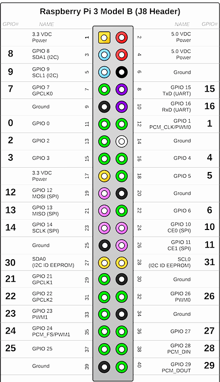
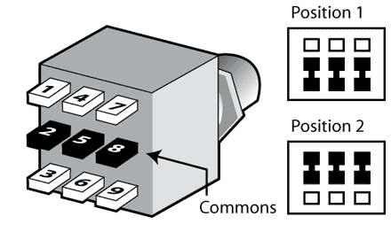

# pipurr

This is a cheap & easily-programmable effects pedal / synth that's easy to build.

It uses [purrdata](https://agraef.github.io/purr-data/).

You can use it to make effect pedals, synthesizers, and all manner of other devices.

When it starts up, it registers itself as a USB serial/network device, and can be used standalone or with a computer. I'd eventually like it to also show up as a audio input (so you can record audio on your computer, or input audio from your computer) and MIDI device (so you can control it.)

Get a disk-image from [releases](https://github.com/konsumer/zerostomp/releases) and [put it on an SD card](https://learn.adafruit.com/introducing-the-raspberry-pi-zero/setting-up-your-sd-card).


## hardware

The pedal is meant to operate plugged-in (no battery power) and uses a pi-zero to do all the work. It uses 4 rotary-encoders for input, a single 3PDT footswitch for true-bypass. It has a OLED screen to display status and show the values of different parameters. The USB power plug is hooked up to the piZero data-port, so it can get power & also run in USB host mode if it's connected to a computer.

To make your own, you'll need some cheap hardware:

* pi-zero
* pizero audio-device. I can't seem to find the [Audio Injector Zero Sound Card](http://www.audioinjector.net/rpi-zero) anymore, which is what I used, but anything should work fine, just make sure you setup whatever is needed, in terms of kernel-support.
* i2c 12864 OLED like [this](https://www.amazon.com/gp/product/B07WPCPM5H)
* 4X [rotary-encoders](https://www.amazon.com/WayinTop-Degree-Encoder-Development-Arduino/dp/B07T5DZYZ1/)
* [nice clunky 3PDT switch](https://lovemyswitches.com/3pdt-latched-foot-switch-solder-lugs-blue/)
* 2x [mono jacks](https://www.amazon.com/NANYI-Female-Stereo-Cables-Snakes/dp/B07P77KZ3V)
* [a nice case](https://www.amazon.com/Support-1590BB-Aluminum-Enclosure-Guitar/dp/B015334KM2)

### putting it together

For audio-device prefer "mic" over "line-in" input, for amplified signal. It should work either way, but mic should have a built-in amplifier. Try it both ways and see what sounds good.

Refer to this, for info about GPIO, below:



[pinout.xyz](https://pinout.xyz/) can also be really useful too, for reference.


#### 3PDT switch

Hook it up in a [true bypass](https://www.coda-effects.com/2015/03/3pdt-and-true-bypass-wiring.html) configuration. Refer to this image:



- 1 to 4
- 2 to input jack signal
- 3 to audio-device input (prefer mic)
- 5 to output jack signal
- 6 to audio-device output (line-out)
- 7 to ground of pi (pin 6, 9, 14, 20, 25, 30, 34, or 39) to input/output jack grounds
- 8 to GPIO0 of pi stomp (pin 11)
- 9 to 5V of pi (2 or 4)

Now it will work like this:

- *OFF* - (up) output will be connected to input, and the pi will get ground on GPIO0
- *ON* - (down) input/output will be connected to audio-device, and the pi will get 5V on GPIO0

#### OLED

It uses i2c, so hook up power of pi: 5V (pin 2 or 4) and ground (pin 6, 9, 14, 20, 25, 30, 34, or 39) and i2c (SDA to pin 3, and SCL to pin 5.)


#### rotary encoders

All of the `+` pins go to 3.3V (pin 1 or 17) and `-` goes to ground (pin 6, 9, 14, 20, 25, 30, 34, or 39.) After that each rotary-encoder has 3 pins (`SW`, `DT` & `CLK`):

| BOARD (physical pin) | BCM (GPIO) | Rotary Pin |
|----------------------|------------|------------|
| 13                   | 2          | SW         |
| 15                   | 3          | DT         |
| 16                   | 4          | CLK        |

| BOARD (physical pin) | BCM (GPIO) | Rotary Pin |
|----------------------|------------|------------|
| 18                   | 5          | SW         |
| 22                   | 6          | DT         |
| 7                    | 7          | CLK        |

| BOARD (physical pin) | BCM (GPIO) | Rotary Pin |
|----------------------|------------|------------|
| 24                   | 10         | SW         |
| 26                   | 11         | DT         |
| 19                   | 12         | CLK        |

| BOARD (physical pin) | BCM (GPIO) | Rotary Pin |
|----------------------|------------|------------|
| 21                   | 13         | SW         |
| 23                   | 14         | DT         |
| 29                   | 21         | CLK        |


#### audio-device

I used a [Audio Injector Zero Sound Card](http://www.audioinjector.net/rpi-zero), which I can't seem to find for sale anywhere. Anything like this should work fine, and I'm happy to put instructions for other cards, when people get them working, so let me know.

Here is what I did to make mine work:

Add this to `/boot/config.txt`:

```
# enable Audio Injector Zero sound card
dtoverlay=audioinjector-wm8731-audio
```

I also needed to unmute it in `alsamixer` to make sure it worked right.


## usage

### operation

When it powers up, it will display a nice logo (in `/boot/logo.png`), and start listening for input. At any time, pressing rotary-encoder 1 & 4 will jump back to this main menu, where you can select a puredata patch (with knob 1 and press to accept it.) You can enable the effect (connect processing to output) by hitting the stomp switch, and it will update the display with a little icon in the top-right corner.


### making puredata patches

You can make patches on you computer in [purrdata](https://agraef.github.io/purr-data/). Put your patches in `/boot/patches` (or `patches/` on root of SD card) and you will be able to select the patch from the main menu.


## development

You shouldn't need this, unless you are working on a customized disk-image. I designed the tools to work on a linux system, all from `make`. You might be able to get it working on OSX, or WSL in Windows, but I haven't tested. You'll need make, docker, qemu-user, unzip and wget installed.